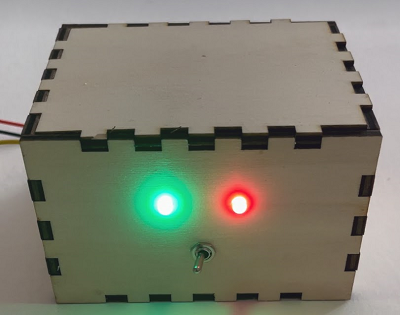
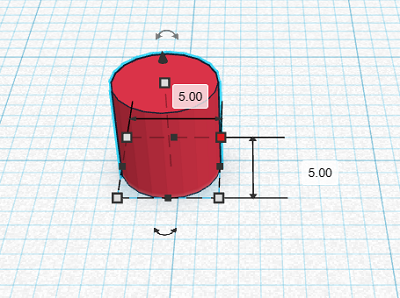
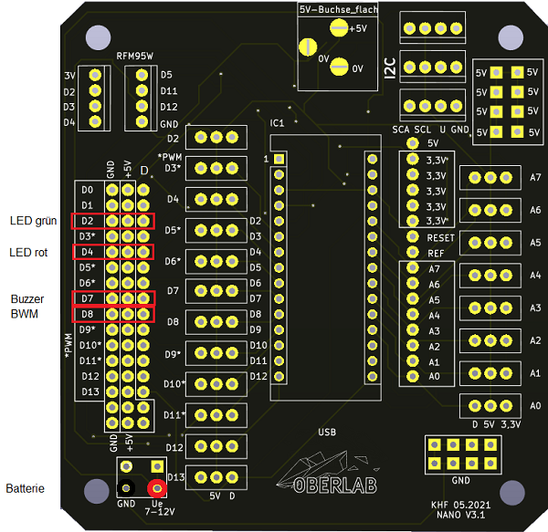
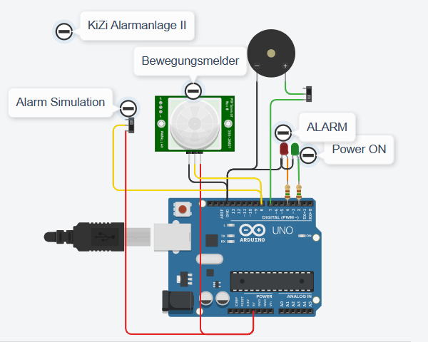
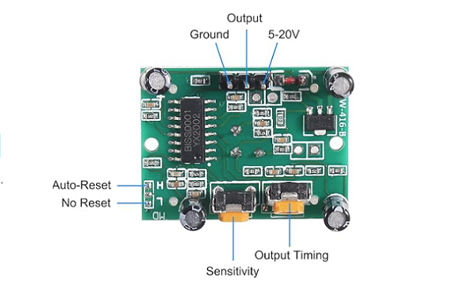

# KiZi-Alarm
Einfache Alarmanlage mit Bewegungsmelder, Buzzer und LEDs

## Story

Diese Repo beschreibt den Aufbau einer Alarmanlage für das Kinderzimmer. Ein Bewegungsmelder überwacht das Kinderzimmer auf "Bewegung". Die grüne LED zeigt an, ob die Alarmanlage eingeschaltet ist. Erkennt der Bewegungsmelder eine Bewegung, blinkt eine rote LED und ein Buzzer ertönt. Für einen "stillen Alarm" kann der Buzzer deaktiviert werden. Am Bewegungsmelder sind zwei Potentiometer mit denen die Empfindlichkeit und die Alarmdauer eingestellt werden kann.
Überwachte Bereiche sollten gekennzeichnet werden. Bringe einen Hinweis an geeigneter Stelle an.

## Hardware
Die Stückliste für den KiZi-Alarm:

+ 1 x NANO
+ 1 x NANO Shield
+ 1 x LED rot
+ 1 x LED grün
+ 2 x Widerstände 150R
+ 1 x HC-SR501 PIR Infrarot Sensor
+ 1 x Buzzer
+ 2 x Schalter
+ 2 x Buchsenleisten
+ 1 x 9V Batterie oder ein Netzteil
+ 1 x 9V Batterie-Clip
+ 1 x Gelasertes Gehäuse (4mm Sperrholz 600x300)
+ Kleinmaterial, Schaltdraht

## Aufbau und Montage
Der Aufbau und die Montage des KiZi-Alarm II ist in mehrere Schritte unterteilt.

### Schritt 1: 3D-Druck
Zeichne und drucke 4 Platinen Füße für das ESP32-Shield, D=5mm x 5mm
Klebe die Füße auf die Unterseite des Shields

### Schritt 2: Verdrahtung und Lötarbeiten
+ Bestücke das NANO-Shield mit den Buchsenleisten
+ Verdrahte das Shield und die Komponenten entsprechend den Aufbauplan
+ Der Bewegungsmelder kann auch ausserhalb des Kinderzimmers angebracht werden
+ Bewegungsmelder GND, VCC, GPIO8
+ LED grün mit 150R Widerstand an GND, GPIO2
+ LED rot mit 150R Widerstand an GND, GPIO4
+ Buzzer GND, GPIO7 über den Schalter S2
+ Spannungsversorgung mit Schalter S1

Ist der Jumper ganz außen, wird das Ausgangssignal, nachdem eine Bewegung detektiert wurde, für eine gewisse Zeit aufrecht erhalten und danach auf jeden Fall wieder deaktiviert, auch wenn im Aktionsbereich des Bewegungsmelders noch eine Bewegung detektiert werden könnte. Nach einer gewissen Zeit wird das Ausgangssignal erneut erzeugt.
Ist der Jumper ist leicht nach innen versetzt, bleibt das Ausgangssignal aktiv, so lange vom Bewegungsmelder eine Bewegung detektiert wird.

### Schritt 3: Das Gehäuse
+ Erstelle auf Boxes.PY ein Gehäuse.
+ Zeichne alle Druchbrüche für Schalter, LEDs, Spannungsversorgung und den Bewegungsmelder ein
+ Montiere den NANO mit dem Shield und die Komponenten in das Gehäuse

### Schritt 4: Programmierung
+ Erstelle auf TINKERCAD das Programm und teste es

### Schritt 5: Inbetriebnahme
+ Kontrolliere alle Verbindungen
+ Lade das Programm in den NANO
+ Versorge die KiZi-Alarmanlage II mit Spannung
+ Teste die Alarmanlage

   
<ol class="breadcrumb" style="border-top: 2px solid black;border-bottom:2px solid black; height: 45px; width: 900px;"> 
<a href="#oben">nach oben</a>
</ol>

  

